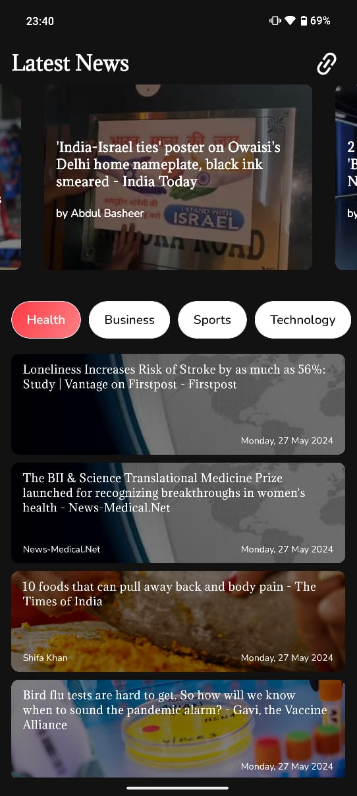
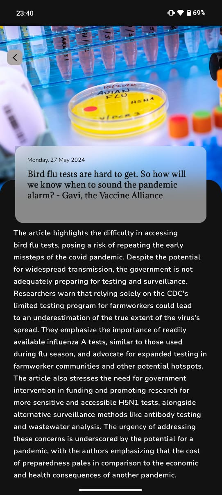
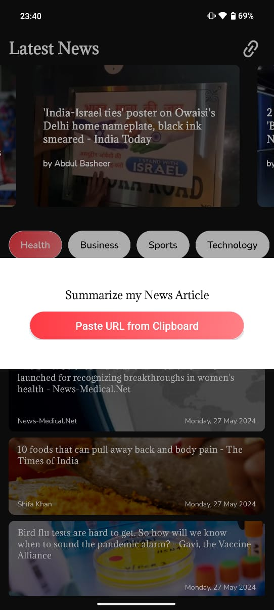

 

  

  <h3 align="center">NewsWhiz</h3>

  

    "News Smarter, Read Faster"
     
     
  

## Table Of Contents

* [About the Project](#about-the-project)
* [Built With](#built-with)
* [Getting Started](#getting-started)
  * [Prerequisites](#prerequisites)
  * [Installation](#installation)
* [Authors](#authors)

## About The Project

NewsWhiz is a news app powered by AI, using NewsAPI and Google Gemini Bard API. It fetches news from various sources and provides users with summarized article content. Users can also paste article URLs for quick summaries. Developed with JAVA and Android Studio, NewsWhiz offers a seamless way to stay updated.

## Built With

NewsWhiz is built using JAVA and Android Studio, integrating the capabilities of NewsAPI for fetching news and Google Gemini Bard API for article summarization. This combination provides users with efficient access to summarized news content directly from various sources and article URLs.

## Getting Started

Fork the project and run using Android Studio IDE to run on its emulators.

### Prerequisites

Android Device with API more level more than 25 or android version above Oreo. 

### Installation

Go to this link download the APK and install and use.
If forking the project get the correct API keys for the NewsApi.org and Gemini APi
 
You may have to accept certain security warnings before installing the application.
<a href = "NewsWhiz.apk">Link</a>

### Creating A Pull Request

1. Fork the Project
2. Create your Feature Branch
3. Commit your Changes 
4. Push to the Branch
5. Open a Pull Request

## Authors

* **Akash Srivastava** - *3rd Year Computer Science Student* - [Akash Srivastava](https://github.com/aCash9) - *Developer*
